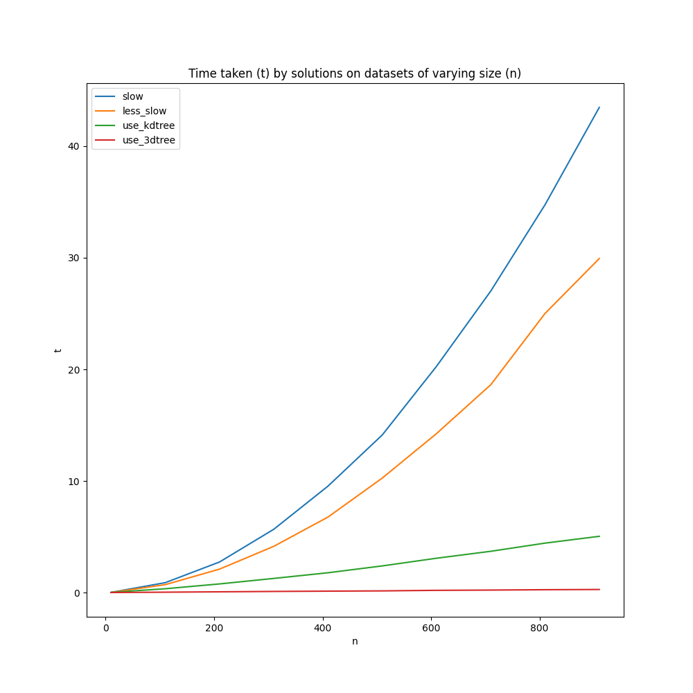

# Nearest Neighbour Optimization

Git repository for the exercise described in `TASK.md`.

You can install this package with `pip`:

```
pip install git+https://github.com/peterprescott/optimize-nn
```

You can then profile the solutions:

```
python -m opt_nn.profile
```



Testing on a (still relatively small) dataset of 910 points, 
`given.slow()` takes `43.47` seconds, while `xyz.use_3dtree()` 
takes just `0.28` -- more than 100 times faster!

